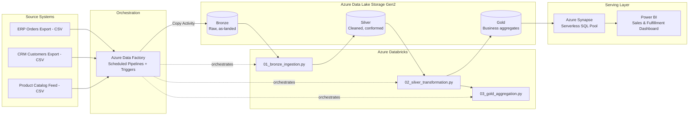

# Azure Retail Data Platform — End-to-End Batch ELT Pipeline

A portfolio project demonstrating a production-style **batch ELT data platform** on Azure, built with a medallion (Bronze/Silver/Gold) lakehouse architecture, orchestrated ingestion, and a BI-ready serving layer.

> **Scenario:** A mid-size retail/logistics company receives daily order, customer, and product extracts from multiple source systems (ERP export, CRM export, product catalog feed). The platform ingests, cleans, conforms, and aggregates this data into a governed serving layer for reporting on sales performance, customer segments, and fulfillment metrics.

This project is designed to mirror the kind of pipeline work I've built in production (retail/logistics ETL at scale, regulated-data handling in healthcare and banking) — implemented here end-to-end on a modern Azure stack.

## Architecture



**Flow:** ADF triggers a daily pipeline → lands raw files in **Bronze** (ADLS Gen2) with no transformation → Databricks notebook validates schema and writes **Silver** (deduped, typed, conformed) as Delta tables → a second notebook builds **Gold** star-schema aggregates → Synapse serverless SQL exposes Gold as external tables/views → Power BI connects direct to Synapse for reporting.

## Tech stack

| Layer | Service | Role |
|---|---|---|
| Orchestration | Azure Data Factory | Scheduling, ingestion (Copy Activity), pipeline dependency management, failure alerting |
| Storage | Azure Data Lake Storage Gen2 | Bronze/Silver/Gold zones, Delta Lake format |
| Transformation | Azure Databricks (PySpark + Spark SQL) | Cleansing, deduplication, SCD handling, aggregation |
| Serving | Azure Synapse Analytics (serverless SQL pool) | Schema-on-read external tables/views over Gold, cost-efficient query layer |
| Reporting | Power BI | Sales performance, customer segment, and fulfillment dashboards |
| IaC / config | ARM-style JSON exports | ADF pipeline, linked service, and dataset definitions |

## Repository structure

```
├── architecture/          # Design notes and diagram source
├── data/sample_raw/       # Small representative sample of source CSVs
├── adf/                   # ADF pipeline, linked service, dataset JSON definitions
├── databricks/            # PySpark notebooks: Bronze → Silver → Gold
├── synapse/               # Serverless SQL views/external tables over Gold
├── powerbi/               # Report structure, measures, refresh approach
└── docs/                  # Data dictionary and design decisions log
```

## Design decisions worth noting

- **Batch, not streaming.** Sources are daily file drops, not event streams — so this uses ADF scheduled triggers rather than Event Hubs/Structured Streaming. That's a deliberate scope choice, matching the batch ETL/ELT nature of the source systems (see `docs/design_decisions.md`).
- **Medallion architecture** keeps raw data immutable in Bronze, so any Silver/Gold logic bug is always re-runnable from source of truth.
- **Serverless Synapse over dedicated pool** — no need to pay for provisioned compute for a reporting workload of this size; serverless bills per query.
- **Power BI layer is intentionally light on DAX** — measures are kept to straightforward aggregations, with most shaping done upstream in Gold/Power Query, reflecting where my hands-on depth actually is.

## Status

This is a **design-and-code portfolio artifact**, not a live-deployed environment — the ADF/Synapse JSON and Databricks notebooks are written to be deployable as-is against an Azure subscription, and were validated for logic against the sample data in `data/sample_raw/`, but are not currently running against a provisioned Azure resource group.

## Skills demonstrated

ADF pipeline design and orchestration · ADLS Gen2 zone architecture · PySpark/Spark SQL transformation · Delta Lake · Synapse serverless SQL · dimensional (star schema) modeling · Power BI report design · data quality/validation patterns · Git-based project documentation
